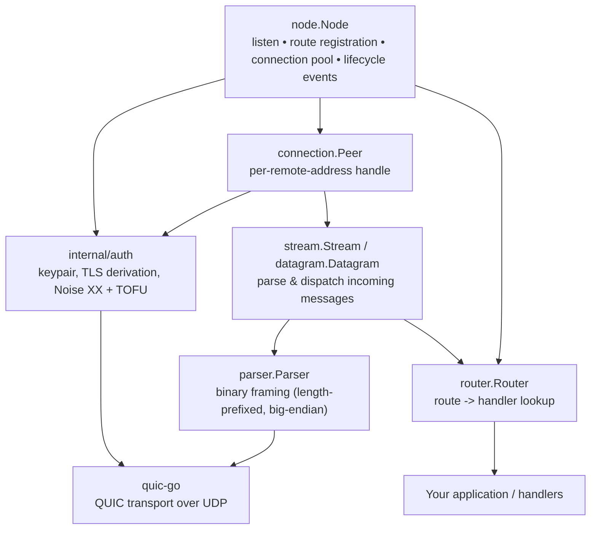

# quicnode

A Go library for building peer-to-peer systems over **QUIC**. quicnode handles the transport layer — connection establishment, stream multiplexing, unreliable datagrams, and optional Noise-based authentication — so you can focus on application logic.

It exposes a small, route-oriented API: register handlers by name and send requests to remote peers over reliable streams or unreliable datagrams.

## Overview

quicnode is a **transport library**. It is built on [`quic-go`](https://github.com/quic-go/quic-go) and provides:

- A `node.Node` that both **listens** for incoming QUIC connections and **dials** out to peers.
- **Reliable, ordered request/response** over QUIC streams, dispatched by named *routes*.
- **Unreliable datagrams** (fire-and-forget) for loss-tolerant, low-latency data.
- **Automatic TLS** — self-signed certificates are derived deterministically from the node's keypair, so you never manage certificates.
- **Optional Noise XX authentication** with Trust On First Use (TOFU) peer identity.

What quicnode is **not**: it does not provide peer identity/public-key infrastructure by default, peer discovery (DHT, mDNS), or a decentralized consensus layer. It is a transport layer — bring your own discovery and overlay-lookup mechanisms if you need them.

## Features

- Route-based handler API for stream request/response and datagrams.
- Connection pooling: a connection to a remote address is created once and reused; duplicate connections from the same address are deduplicated.
- Connection lifecycle events (opened / closed) via a channel.
- Fully automatic TLS: no certificate configuration required.
- Optional Noise XX mutual authentication with TOFU key pinning and stable `PeerID`s.
- Deterministic node identity persisted to disk keyed by a Curve25519 keypair.

## Requirements

- **Go 1.25 or newer** (per `go.mod`).
- No OS-specific features — works on any platform supported by Go and `quic-go` (Linux, macOS, Windows, etc.). QUIC runs over UDP.
- Network: nodes communicate over UDP; peers must be reachable by address (`host:port`).

## Installation

```bash
go get github.com/Dishank-Sen/quicnode@latest
```

The latest release is `v0.0.13`.

## Quick Start

A complete two-node round trip: node A listens and handles an `echo` route; node B connects and sends a request.

```go
package main

import (
	"context"
	"fmt"

	"github.com/Dishank-Sen/quicnode/node"
	"github.com/quic-go/quic-go"
)

func main() {
	ctx := context.Background()

	// Node A: server. Listens on 4242, handles requests.
	server, _ := node.NewNode(ctx, node.Config{
		ListenAddr: "127.0.0.1:4242",
		QuicConfig: &quic.Config{},
	})
	server.Start()

	server.HandleStream("echo", func(c node.StreamContext) {
		c.Write([]byte("echo: " + string(c.Payload())))
	})

	// Node B: client. Connects to A and sends a request.
	client, _ := node.NewNode(ctx, node.Config{
		ListenAddr: "127.0.0.1:4243",
		QuicConfig: &quic.Config{},
	})
	client.Start()

	peer, err := client.OpenConn(ctx, "127.0.0.1:4242")
	if err != nil {
		panic(err)
	}

	respCh, err := peer.Send("echo", []byte("hello"))
	if err != nil {
		panic(err)
	}
	fmt.Printf("Got: %s\n", <-respCh) // Got: echo: hello
}
```

Note that both nodes call `Start()` before dialing — `OpenConn` uses the transport created by `Start()`. The `QuicConfig` is required; a zero `&quic.Config{}` is fine unless you need custom QUIC options.

## Core Concepts

### Node

A `node.Node` is both a server and a client. It binds a UDP socket to `ListenAddr`, accepts QUIC connections, maintains a pool of outgoing connections, and dispatches incoming requests to registered handlers. Create it with `NewNode`, start it with `Start`, shut it down with `Stop`, and block on it with `Wait`.

### Routes and handlers

Routes are plain strings that name a communication channel. You register handlers with `HandleStream` and `HandleDatagram`:

- A stream handler receives a reliable, ordered request and can write one or more responses back.
- A datagram handler receives a single unreliable message and cannot respond.

An incoming message whose route has no registered handler is answered with an error frame (streams) or dropped (datagrams).

**Route prefix `_` is reserved** for internal routes. Registering a route that starts with `_` panics.

### Streams vs. Datagrams

|                    | Streams                                        | Datagrams                              |
| ------------------ | ---------------------------------------------- | -------------------------------------- |
| `Send` transport   | QUIC stream (reliable, ordered)                | QUIC datagram (unreliable, unordered)  |
| Delivery           | Guaranteed, in-order, retransmitted            | Best-effort; may be lost/reordered     |
| Response           | Yes — write back via `ctx.Write`               | No, one-way                            |
| Use cases          | Commands, RPC, transfers                       | Telemetry, position updates, heartbeats |
| Required QUIC cfg  | none                                           | `quic.Config{EnableDatagrams: true}`   |

### Peers

`OpenConn(ctx, addr)` returns a `*Peer` handle for a remote address. If a connection to that address already exists, it is reused. Use `Peer.Send` for streams and `Peer.SendDatagram` for datagrams. Peers outlive individual requests and stay open until closed or the node shuts down.

### Connection pooling and events

Connections are pooled per remote address. If a second connection arrives from an already-connected address, the old connection is closed and replaced. `Node.Events()` returns a channel of `types.Event` values (`EventConnOpened` / `EventConnClosed`). The channel is buffered to 100; unconsumed events are dropped rather than blocking.

### Security model

- **Transport encryption** is provided by TLS over QUIC. quicnode auto-generates a self-signed certificate from the node's keypair and uses `InsecureSkipVerify`, because identity is handled separately (see below).
- With **`RequireAuth: true`**, every connection performs a **Noise XX** handshake before any application stream is accepted. The peer's Curve25519 public key is pinned via **TOFU**: first contact stores the key; later connections must present the same key or are rejected. Handler callbacks can read the authenticated identity via `ctx.PeerID()` and `ctx.PeerPublicKey()`.

> ⚠️ Without `RequireAuth: true`, there is **no peer identity verification** — TLS transport is encrypted, but any peer that can reach your listener can connect. Authentication is only as strong as your TOFU store: pinning is skipped entirely when auth is disabled.

## Usage

### Basic stream request/response

Register a handler on the server side:

```go
node.HandleStream("sum", func(c node.StreamContext) {
	// Parse two ints from the request payload, return their sum.
	parts := strings.Split(string(c.Payload()), ",")
	a, _ := strconv.Atoi(parts[0])
	b, _ := strconv.Atoi(parts[1])
	c.Write([]byte(strconv.Itoa(a + b)))
})
```

Send a request from the client side. `Send` returns a channel that yields each response frame the handler wrote; the channel is closed when the handler finishes:

```go
peer, err := client.OpenConn(ctx, "127.0.0.1:4242")
if err != nil {
	// handle
}
respCh, err := peer.Send("sum", []byte("4,5"))
if err != nil {
	// handle
}
result, ok := <-respCh // ok == false if the channel closed without a response
if ok {
	fmt.Println(string(result)) // "9"
}
```

A handler may call `ctx.Write` multiple times; each call produces one frame that arrives as one value on the response channel.

### Datagrams

Datagrams require `EnableDatagrams` in the QUIC config on **both** nodes:

```go
config := &quic.Config{EnableDatagrams: true}

server, _ := node.NewNode(ctx, node.Config{
	ListenAddr: "127.0.0.1:4242",
	QuicConfig: config,
})

server.HandleDatagram("position", func(c node.DatagramContext) {
	// One-way: no response. c.Payload() / c.PeerAddr() available.
	updatePlayer(c.PeerAddr(), c.Payload())
})
```

```go
peer, _ := client.OpenConn(ctx, "127.0.0.1:4242")
peer.SendDatagram("position", encodedPosition) // fire-and-forget
```

### Enabling Noise XX authentication

Set `RequireAuth: true` on **both** the node that serves and the node that dials:

```go
server, _ := node.NewNode(ctx, node.Config{
	ListenAddr:  "127.0.0.1:4242",
	QuicConfig:  &quic.Config{},
	RequireAuth: true, // both sides must enable this
})
```

On first run a Curve25519 keypair is generated and persisted. When a peer connects, a Noise XX handshake runs over the reserved internal `_noise` stream before application streams are accepted. Handlers can inspect the authenticated identity:

```go
node.HandleStream("greet", func(c node.StreamContext) {
	fmt.Println("peer id:", c.PeerID())           // base58(sha256(pubkey))
	fmt.Println("peer key:", c.PeerPublicKey())    // 32-byte Curve25519
})
```

### Connection lifecycle events

```go
for ev := range node.Events() {
	switch ev.Type {
	case types.EventConnOpened:
		fmt.Println("opened", ev.ConnID)
	case types.EventConnClosed:
		fmt.Println("closed", ev.ConnID, ev.Err)
	}
}
```

### Graceful shutdown

`Stop()` closes the listener, the UDP socket, and all peer connections, and cancels the node's context. It is idempotent (safe to call more than once). `Wait()` blocks until the node shuts down or a background goroutine fails, returning the first error.

```go
node.Start()
defer node.Stop()
if err := node.Wait(); err != nil {
	log.Printf("node stopped: %v", err)
}
```

## API Overview

The public API lives in the `node` package. The `types` package defines the event types.

### Node

| Function / Method | Description |
| ----------------- | ----------- |
| `NewNode(ctx, cfg Config) (*Node, error)` | Creates a node. `ctx` controls lifetime (`nil` is rejected). Validates `cfg`. |
| `(*Node) Start() error` | Binds UDP, creates the listener, spawns the accept loop. Non-blocking. Returns an error if the port is in use. **Must be called before `OpenConn`.** |
| `(*Node) Stop() error` | Shuts down the node, closes all connections. Idempotent. |
| `(*Node) Wait() error` | Blocks until shutdown or the first background error. Call after `Start()` to keep the process alive. |
| `(*Node) HandleStream(route string, h StreamHandlerFunc)` | Registers a stream handler for `route`. |
| `(*Node) HandleDatagram(route string, h DatagramHandlerFunc)` | Registers a datagram handler for `route`. |
| `(*Node) OpenConn(ctx, addr string) (*Peer, error)` | Returns a pooled `*Peer` for `addr` (`host:port`). Reuses an existing connection if present. |
| `(*Node) Events() <-chan types.Event` | Channel of connection lifecycle events (buffer 100; dropped when full). |

### Peer

`Peer` is a handle to a remote connection. Public fields: `Addr string`, `ID types.ConnID`, and (when authenticated) `PublicKey []byte`, `PeerID string`, `IsAuthenticated bool`.

| Method | Description |
| ------ | ----------- |
| `Send(route string, payload []byte) (<-chan []byte, error)` | Sends a stream request. Returns a channel of response frames, closed when the peer finishes. Reliable and ordered. |
| `SendDatagram(route string, payload []byte) error` | Sends an unreliable datagram. Returns an error only if the frame could not be enqueued locally — **not** if it is lost in transit. No response. |
| `Close()` | Closes the connection to this peer. |
| `GetAuthInfo() (publicKey []byte, peerID string, authenticated bool)` | Returns the authenticated identity (empty values when auth is disabled or incomplete). |

### Handler contexts

`StreamContext` (`stream.Context`) — available in `HandleStream` callbacks:

| Method | Description |
| ------ | ----------- |
| `Route() string` | The route of the request. |
| `Payload() []byte` | Request payload bytes. |
| `PeerAddr() string` | Remote peer address. |
| `Write([]byte) (int, error)` | Writes a response frame. May be called multiple times. |
| `PeerID() string` | Stable `base58(sha256(publicKey))` of the authenticated peer; empty when auth is disabled. |
| `PeerPublicKey() []byte` | The peer's 32-byte Curve25519 static key; `nil` when auth is disabled. |

`DatagramContext` (`datagram.Context`) — available in `HandleDatagram` callbacks:

| Method | Description |
| ------ | ----------- |
| `Route() string` | The route of the datagram. |
| `Payload() []byte` | Datagram payload bytes. |
| `PeerAddr() string` | Remote peer address. |

Datagram handlers have no `Write` — datagrams are one-way.

### Config

```go
type Config struct {
	ListenAddr  string       // host:port to bind, e.g. "127.0.0.1:4242" or ":4242"
	QuicConfig  *quic.Config // REQUIRED QUIC transport settings
	RequireAuth bool         // enable Noise XX + TOFU authentication (default false)
}
```

Validation (`NewNode` returns an error for any of these): `ListenAddr` must be valid `host:port` with a port in `1–65535`; `QuicConfig` must be non-nil; a `nil` context is rejected.

## Configuration

`node.Config` is the only user-facing configuration surface. QUIC-level options are passed through `QuicConfig` directly to `quic-go`.

| Field | Type | Default | Description |
| ----- | ---- | ------- | ----------- |
| `ListenAddr` | `string` | none (required, validated) | Local UDP address to bind (`host:port`). `:4242` binds all interfaces. |
| `QuicConfig` | `*quic.Config` | none (required) | QUIC transport configuration passed to `quic-go`. Set `EnableDatagrams: true` to use datagrams. |
| `RequireAuth` | `bool` | `false` | When true, require a Noise XX handshake and TOFU key verification on every connection, and expose peer identity to handlers. |

### Environment / on-disk state

| Setting | Location |
| ------- | -------- |
| Node keypair (private + public) | `$XDG_DATA_HOME/quicnode/` or `~/.local/share/quicnode/` (`node.key` mode `0600`, `node.pub` mode `0644`) |
| TOFU known-peers store | `$XDG_DATA_HOME/quicnode/known_peers/<peerID>.pub` or `~/.local/share/quicnode/known_peers/` |

The keypair is generated on first `NewNode` call and reused thereafter — deleting it changes node identity. Set `XDG_DATA_HOME` to relocate the store.

There is no command-line interface and no environment-variable configuration beyond `XDG_DATA_HOME` controlling key storage.

## Error Handling

Errors are returned as standard Go errors; there are no sentinel error variables in the public API. Key behaviors:

- `NewNode` returns an error for invalid config (bad address, missing `QuicConfig`, nil context).
- `Start` returns an error if the UDP port cannot be bound (e.g., already in use).
- `OpenConn` returns an error if the address is invalid or dialing fails; it also wraps an `"authentication failed: ..."` error if a required Noise handshake fails.
- `Peer.Send` / `Peer.SendDatagram` return errors from framing or the underlying QUIC stream. For datagrams, the error indicates the frame could not be enqueued — not that it reached the peer.
- Handler-side failures are **not** propagated to the caller as Go errors. A handler that writes `"error: ..."` frames does so as ordinary payload; a route with no handler causes the caller's response channel to close empty. Treat `ok == false` on `<-respCh` as "no response".
- `HandleStream` / `HandleDatagram` **panic** on a nil handler, an empty route, or a route starting with `_`.

## Wire Format

All integers are big-endian; routes are UTF-8; payloads are opaque bytes.

```
Stream request:
┌──────────────────┬─────────────────┬──────────────────┬──────────────┐
│ Route Length (2) │ Route (variable)│ Payload Len (4)  │ Payload      │
└──────────────────┴─────────────────┴──────────────────┴──────────────┘

Stream response:
┌──────────────────┬──────────────┐
│ Payload Len (4)  │ Payload      │
└──────────────────┴──────────────┘

Datagram:
┌──────────────────┬─────────────────┬──────────────┐
│ Route Length (1) │ Route (variable)│ Payload      │
└──────────────────┴─────────────────┴──────────────┘
```

You do not need to implement this format yourself — it is handled by `Peer.Send`, handler contexts, and `SendDatagram`. It is documented here for interoperability and for debugging.

## Architecture

An incoming request flows from the QUIC transport up through the node to your handler; outgoing requests flow the other way.



The `node` package is the only intended public entry point; `connection`, `router`, `parser`, `stream`, `datagram`, and `auth` are all under `internal/` and cannot be imported by other modules.

## Limitations

- **No identity, discovery, or decentralization.** quicnode is a transport library. Peer discovery (DHT, mDNS) and any overlay identity must be provided by your application. The reserved internal routes `_ping` and `_peers` (peer-list exchange) are **not implemented** — they are reserved placeholders.
- **Datagrams require `EnableDatagrams: true`** on the QUIC config.
- **Authentication is opt-in and must be symmetric.** If only one side sets `RequireAuth`, connections will fail or be unauthenticated. Without it, there is no peer identity verification (though transport is TLS-encrypted).
- **TOFU has no out-of-band bootstrap.** The first connection to a peer is trusted implicitly — a MITM on first contact would be pinned. Revoke a peer by deleting its file from `known_peers/`. Key rotation is not supported.
- **No public key-management API.** `GetKnownPeers` / `RemoveKnownPeer` live in `internal/auth` and are **not importable** by external modules. To review or revoke trust you must touch the `known_peers/` directory on disk directly.
- **No user-controlled TLS.** TLS is fully auto-managed with self-signed certs and `InsecureSkipVerify`; peer identity is provided by Noise XX only when auth is enabled.
- **Multiple simultaneous connections from one address** cannot coexist — the pool deduplicates by remote address, closing the older connection.
- **Events can be dropped** if you do not drain the `Events()` channel (buffer size 100).
- **Route length caps:** stream routes and payloads are length-prefixed with 16-bit / 32-bit integers respectively; datagram routes are capped at 255 bytes (a longer route returns an error from `SendDatagram`).

## Compatibility / Versioning

The module is at an early, pre-`v1.0.0` stage (`v0.0.13` is the latest tag). The API has already undergone breaking changes between versions — most notably the removal of the `TlsConfig` field in favor of automatic TLS derivation. Expect the API surface to continue evolving. The module path is `github.com/Dishank-Sen/quicnode`.

Public packages: `node` (primary API) and `types` (event types). All other packages are internal and not covered by compatibility guarantees.

## Development

Clone and test:

```bash
git clone git@github.com:Dishank-Sen/quicnode.git
cd quicnode

go build ./...    # builds all packages
go vet ./...      # static analysis
go test ./...     # runs unit tests
go test -race ./...   # with race detector
```

Notes for contributors:

- `go build ./...` and `go vet ./...` pass.
- All test packages pass except `node.TestNewNode_NilContext`, which asserts that `NewNode(context.TODO(), ...)` returns a "context is nil" error. The production code correctly rejects only a literal `nil` context, so `context.TODO()` (non-nil) does not error and this single test assertion is stale. The library itself behaves as intended.
- There is no `cmd/` directory — this is a library, not a binary.
- Loose external integration examples referenced by some docs (`/mnt/data/quicnode-testing/auth_test/main.go`) live outside this repository and are not part of the module.

## Additional Documentation

- `AUTHENTICATION.md` — deeper detail on the Noise XX handshake, TOFU store layout, and trust management. Note that the trust-management code samples there import `internal/auth` and therefore only work from code inside this module.
- `TEST_COVERAGE.md` — test coverage report.
- `CHANGELOG_TLS_DERIVATION.md` — changelog for the TLS auto-derivation change.

## License

No license file is present in this repository, and no license is declared in `go.mod`. Until a license is added, the code is not explicitly licensed for reuse — contact the author before incorporating it into your project.